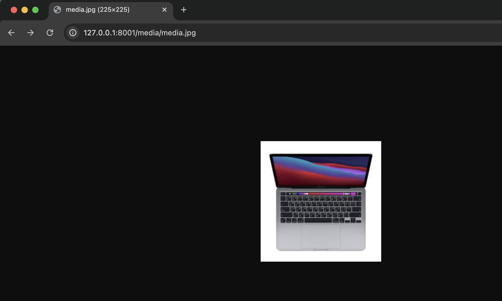

# 作業 Week10
## 練習了哪些當週上課的主題
## 額外找了與當週上課的主題相關的程式技術
## Temporary Log
https://uwsgi-docs.readthedocs.io/en/latest/tutorials/Django_and_nginx.html
- `uwsgi --http :8000 --module mysite.wsgi`: should be `uwsgi --http :8000 --module backend.wsgi` and run under `/django`
- `nginx` will serve on `localhost:8080` on Mac (install with `brew install nginx`)
- to locate `uwsgi_params`, see `/usr/local/etc/nginx` or `/opt/homebrew/etc/nginx` (Mac)
- basic nginx test: fixed by adding `127.0.0.1` to allowed_host 
- `uwsgi --socket :8001 --wsgi-file test.py` 

## 組員分工情況

- 林姵均: 
- 呂學銘: 
- 鄭絜元: 
- 郭品謙: 