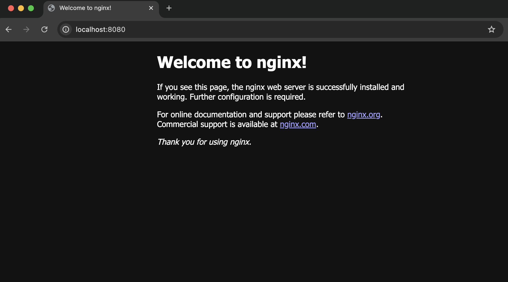
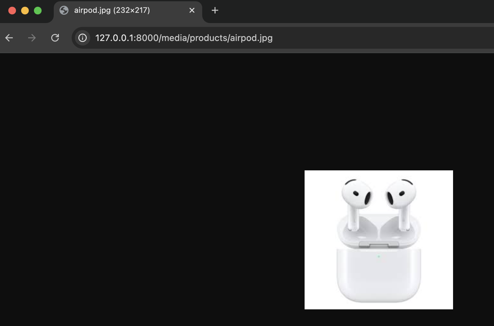
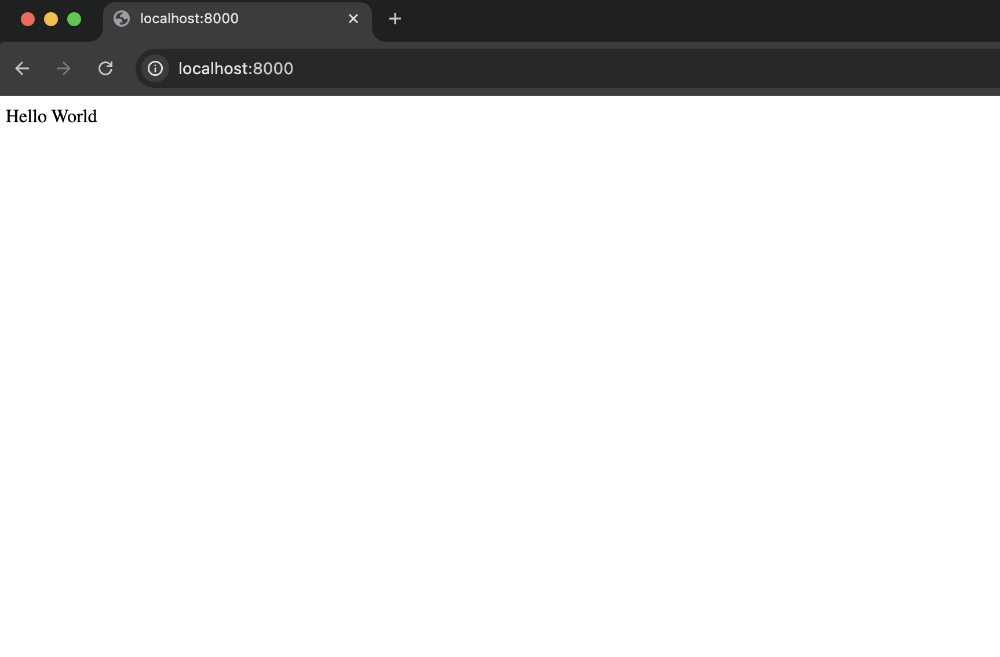
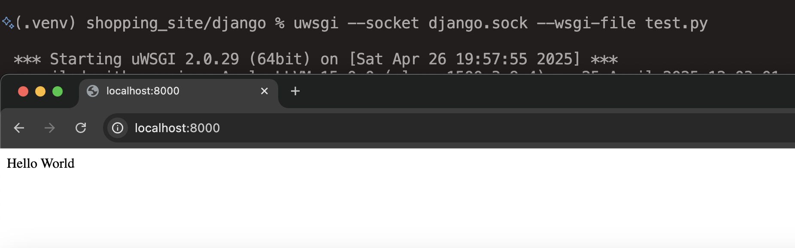
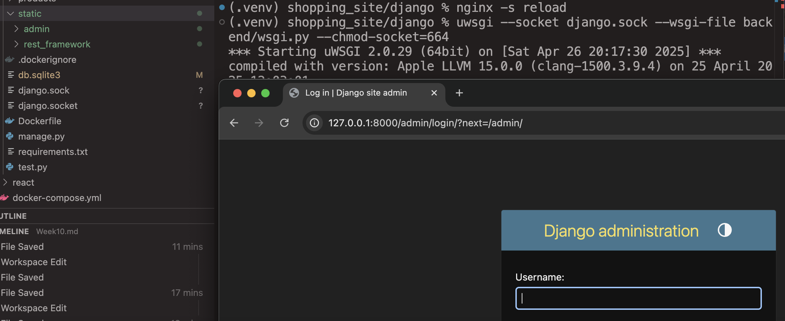

# 作業 Week10
## 練習了哪些當週上課的主題
1. 在後端模型中加入了 Category 類別，並以 ForeignKey 建立了產品與分類的一對多資料庫關聯
2. 在前端加入 SearchBar 搜尋列，利用 axios 實作 AJAX 非同步搜尋功能，與 Django REST API 連動，達到無刷新更新商品結果的效果
## 額外找了與當週上課的主題相關的程式技術
### uwsgi & nginx
https://uwsgi-docs.readthedocs.io/en/latest/tutorials/Django_and_nginx.html
- `uwsgi --http :8000 --module mysite.wsgi`: should be `uwsgi --http :8000 --module backend.wsgi` and run under `/django`
- `nginx` will serve on `localhost:8080` on Mac (install with `brew install nginx`)
- to locate `uwsgi_params`, see `/usr/local/etc/nginx` or `/opt/homebrew/etc/nginx` (Mac)
- basic nginx test: fixed by adding `127.0.0.1` to allowed_host (though `127.0.0.1` will get 502 bad gateway) 
- `uwsgi --socket :8001 --wsgi-file test.py`(requires restart nginx after a while!) 
- `uwsgi --socket django.sock --wsgi-file test.py` 
- `uwsgi --socket django.sock --wsgi-file backend/wsgi.py --chmod-socket=664`(need generate static files by `python manage.py collectstatic` since Django static files are not automatically served by nginx) 
- `uwsgi --ini mysite_uwsgi.ini`: run under `django/`, may need to change full paths in `django.ini`

## 組員分工情況

- 林姵均: uwsgi & nginx
- 呂學銘: 
- 鄭絜元: implement searchbar & build category
- 郭品謙: 