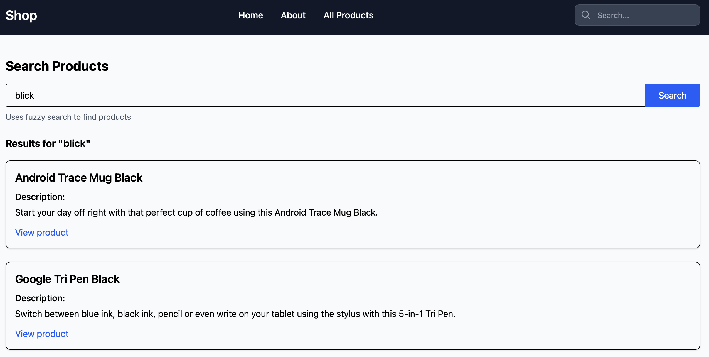

# 作業 Week11
## 練習了哪些當週上課的主題
1. 使用POST表單送出：實作於navbar的search (可見於 `new_shop/shop_app/base.html`, `new_shop/django_shop/shop_app/templates/fuzzy_search.html`, `new_shop/django_shop/shop_app/views.py`)
## 額外找了與當週上課的主題相關的程式技術
1. 參考 [這篇文章](https://dev.to/mongodb/django-mongodb-backend-quickstart-4o89)，以MongoDB做為資料庫。並利用MongoDB的Altas Search完成fuzzy search，讓使用者即使拼錯一些字也一樣能搜尋到一樣的結果（如圖，例如想搜尋"black"但打成"blick"，也仍舊能找到商品）

## 組員分工情況

- 林姵均: 使用POST表單送出、使用MongoDB做為資料庫並實作fuzzy search
- 呂學銘: 
- 鄭絜元: 
- 郭品謙: 
