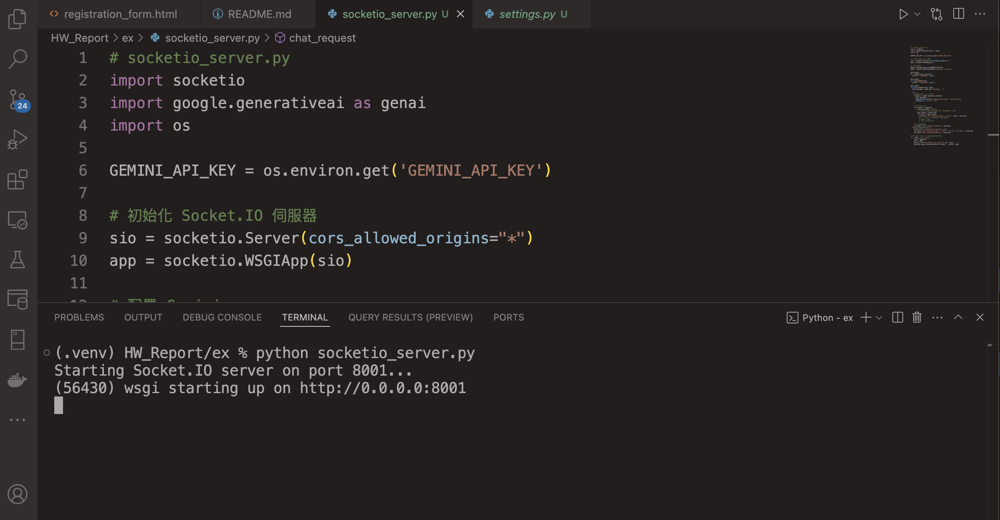
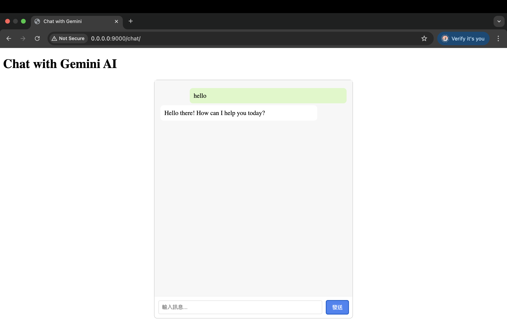

# 作業 Week13
## 練習了哪些當週上課的主題
1. 使用POST表單送出：實作於navbar的search (可見於 `new_shop/shop_app/base.html`, `new_shop/django_shop/shop_app/templates/fuzzy_search.html`, `new_shop/django_shop/shop_app/views.py`)
2. 使用 session 實作了 login and logout 功能(可見於 `shopping_site/`, `sudo docker compose down`, `sudo docker compose up --build`, `localhost:3000`)
3. 使用 django-registration 實作使用者註冊的功能
4. 結合 session and Get 來顯示出登入的會員資料，以及可以修改個人資料
5. 使用 Gemini API Key串接LLM （於 `ex/` 中），啟動socket後，與Gemini對話（如截圖）
6. 使用 Django REST Framework 提供的 ModelSerializer，來自動將前端送來的資料（JSON）轉成 Python 模型，以及將模型物件轉成 JSON 格式回傳給前端

## 額外找了與當週上課的主題相關的程式技術
1. 參考 [這篇文章](https://dev.to/mongodb/django-mongodb-backend-quickstart-4o89)，以MongoDB做為資料庫。並利用MongoDB的Altas Search完成fuzzy search，讓使用者即使拼錯一些字也一樣能搜尋到一樣的結果（如圖，例如想搜尋"black"但打成"blick"，也仍舊能找到商品）

2. 這週額外學習並實作了 React 的 Context API，來統一管理使用者的登入狀態，並使整個前端應用程式都能即時存取與更新這些資訊。透過建立 `AuthContext` 並在 `App.js` 中提供全局狀態，我讓像 `<Header />` 和 `<LoginPage />` 等元件可以即時存取當前登入的使用者資訊並動態更新畫面，例如登入成功後立即顯示歡迎訊息、登出後導回登入頁等，提升了使用者體驗與程式的可維護性。
3. 為了保護API KEY不外流，在`socketio_server.py`中不直接輸入key值，參考[Set up your API key](https://ai.google.dev/gemini-api/docs/api-key#set-up-api-key)，設定key於本機，並於`socketio_server.py`使用`os.environ.get('GEMINI_API_KEY')`以獲取key值。

## 組員分工情況

- 林姵均: 50% 使用POST表單送出、使用MongoDB做為資料庫並實作fuzzy search、串接Gemini API、編輯README說明。
- 呂學銘: 
- 鄭絜元: 50% Implement login/logout, registration, and membership information funtionality.
- 郭品謙: 
